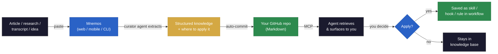

# Mnemos

  

**Feed your agents real knowledge from the world.**

Mnemos is a knowledge pipeline you wire directly into your agents. Feed it anything from the external world — research, frameworks, transcripts, ideas — and your agents can retrieve and apply it in real time, not just what they were trained on.

**This is not a note-taking app. It's infrastructure for agents that need to know things — and actually apply them.**

---

## The problem

Your agents know what you've trained them on. They don't know what you read this morning, what framework you found last week, or what idea you had about your workflow at midnight. Mnemos is the layer that fixes that — a knowledge base that grows in real time and plugs directly into any agent via MCP.

---

## Get started

### 1. Sign up (30 seconds)

Go to **[mnemos-capture.vercel.app](https://mnemos-capture.vercel.app)** → **Sign in with GitHub**.

During setup, Mnemos will:

- Create a knowledge repo in your GitHub account (you own it — plain Markdown files, no proprietary format)
- Ask for your Anthropic API key (your key, stored per-user — Mnemos never pays for your API calls)
- Set a PIN so you can unlock the app quickly on mobile

No config files. No repos to clone. No CLI setup required.

### 2. Capture something

Open the app on any device — phone, tablet, or desktop. Paste any content and hit **Capture**.

The result is auto-committed to your GitHub knowledge repo as a structured Markdown file, immediately available to your agents.

### 3. Connect to Claude Code

After signing up, you get an MCP API key. Run this once in your project:

```bash
claude mcp add mnemos -- npx mnemos-capture serve-mcp --key <your-api-key>
```

Here's what a real session looks like:

```
mnemos - list_inbox (MCP)

Mnemos MCP is connected and working.
It returned 25 captures in your inbox, ranging from March 14 to today (April 2).
```

**Under the hood:** `npx mnemos-capture serve-mcp` runs a lightweight local process that bridges Claude Code's stdio MCP protocol to the Mnemos HTTP API. No data stored locally — everything lives in your GitHub repo.

### 4. Connect to any MCP-compatible agent

Because your knowledge lives in a standard GitHub repo, any agent that can read Git or speak MCP can access it. No lock-in, no custom integration required.

---

## How it fits into your workflow

AI moves fast. Every day there's a new model, a new optimization, a new pattern worth knowing. Most of it is noise — but when something is relevant, you need it available to your agents at the moment they need it, not buried in a tab you'll never reopen.

Mnemos sits between the world and your agents as a filter you control. When you find something worth keeping, you capture it. The curator agent extracts the insight and tags where it applies. It queues up in your knowledge base. When you sit down to work, your agent surfaces what's waiting: "You have 3 new captures — want to apply any of them?" You review, you decide, it executes. The knowledge becomes a skill, a hook, a rule — embedded in your workflow, not forgotten in your bookmarks.

The "Applied to" field is the filter. It forces a concrete decision: where exactly does this belong in your system? That question is what separates knowledge that compounds from knowledge that rots.

---

## How it works



1. **You capture** — paste anything: articles, research papers, threads, transcripts, framework docs, your own ideas for your workflow
2. **Mnemos extracts** — a curator agent pulls the real insight (not a summary), tags it by topic, and flags where it applies in your agent workflows
3. **Your agents retrieve it** — Claude Code, Codex, or any MCP-compatible agent reads your knowledge base and surfaces the right knowledge at the right moment
4. **You decide what gets applied** — the agent surfaces what's in your inbox: "You have 3 new captures, want to see them?" You review. It asks: "Want to apply this?" If yes, it takes the source knowledge and saves it into your workflow as a skill, hook, or rule. If no, it stays in the knowledge base for later. The decision is always yours.

Every capture includes an **"Applied to"** field — a concrete sentence linking what you learned to where it fits in your system. This is what separates a queryable knowledge base from a graveyard of saved content.

### Example output

Paste a research post about a new agentic framework. This is what gets committed to your repo:

```markdown
---
date: 2026-04-01
source: Why Multi-Agent Systems Outperform Single-Agent Loops
url: https://example.com/multi-agent-systems
type: post
tags: multi-agent, orchestration, agent-design, ai-architecture
status: inbox
---

# Why Multi-Agent Systems Outperform Single-Agent Loops

## Core idea
Decomposing complex tasks across specialized agents reduces error propagation
and improves output quality — a single orchestrator routing to focused subagents
consistently outperforms one generalist agent handling everything sequentially.

## Key takeaways
- Specialized agents outperform generalist agents on tasks requiring depth over breadth
- Parallel execution across subagents reduces total latency by 40-60% on multi-step tasks
- Orchestrator-subagent patterns improve error isolation — one agent failing doesn't
  collapse the entire workflow

## Applied to
Evaluate your current single-agent workflows for tasks that could be decomposed
into parallel subagent calls — prioritize anything with 3+ sequential steps.
```

The raw input is preserved in a collapsible block. The curator agent extracts the insight, not a summary. The "Applied to" field is the decision — where exactly this belongs in your system.

---

## What you can feed it

Mnemos handles any text-based input. Paste it, and the curator agent figures out the format and extracts accordingly.

- **Research papers and preprints** — new models, architectures, evaluation methods
- **Framework and library docs** — patterns, APIs, integration approaches worth keeping
- **Optimization techniques** — prompt engineering, caching strategies, latency improvements
- **Technical threads and writeups** — the argument or finding, not the noise
- **Your own ideas** — workflow expansions, agent improvements, architecture decisions you want your agents to act on later
- **Transcripts and talks** — the signal extracted, ready to apply

---

## MCP tools reference

Mnemos exposes 3 tools via MCP:

| Tool | What it does |
|------|-------------|
| `capture` | Runs the full extraction pipeline — curator agent extracts insight, commits to your GitHub repo |
| `search_captures` | Search your knowledge base by keyword or tag |
| `list_inbox` | List all unprocessed captures waiting in your inbox |

The web UI and MCP access the same pipeline. The web UI is for you. MCP is for your agents — they call it programmatically, without you touching the browser.

```bash
# Your agent calls these directly
"Capture this paper on KV cache optimization into my knowledge base"
"Search my captures for anything tagged prompt-engineering"
"List what's in my inbox"
```

---

## Mobile access

Mnemos is a PWA. On your phone: open the app URL → Share → **Add to Home Screen**. Capture from anywhere — your knowledge is available to your agents by the time you sit down to work.

---

## Why GitHub as storage?

Your knowledge lives in a repo you own. No proprietary database, no vendor lock-in. Version-controlled, portable, readable as plain Markdown. Clone it, search it, back it up — it's just files. Any MCP-compatible agent or tool can read from it directly without going through Mnemos.

---

## Your data, your agents

Everything Mnemos produces belongs to you and your agents — not to Mnemos. Your knowledge base is a GitHub repo under your account. Your captured insights are plain Markdown files you can read, clone, move, or delete at any time. Mnemos never trains on your data, never reads your captures for any purpose other than serving them back to you and your agents.

When you stop using Mnemos, your knowledge base stays exactly where it is.

---

## Cost

Mnemos uses your own Anthropic API key (BYOK). You bring your key, Mnemos never charges you for API calls.

Extraction runs on **Claude Haiku** with prompt caching and input truncation, optimized for minimal token usage:

| Usage | Estimated monthly cost |
|-------|----------------------|
| 50 captures/month | ~$0.15 |
| 100 captures/month | ~$0.30 |
| 200 captures/month | ~$0.60 |

Less than $1/month for heavy use.

---

## Tech stack

Next.js · TypeScript (strict) · Anthropic SDK · GitHub OAuth · Vercel Postgres · GitHub Content API · MCP protocol · Tailwind CSS

---

## Roadmap

- Chrome extension for one-click capture from anywhere in the browser
- URL auto-fetch — paste a link, Mnemos fetches and extracts
- Multi-provider support (OpenAI, Google — schema is ready)
- Voice memo capture

---

## Built by

[Soph](https://github.com/Soph20) — builder, AI systems architect. Mnemos powers [Promix](https://promix.dev) in production.

---

## License

[MIT](./LICENSE)
