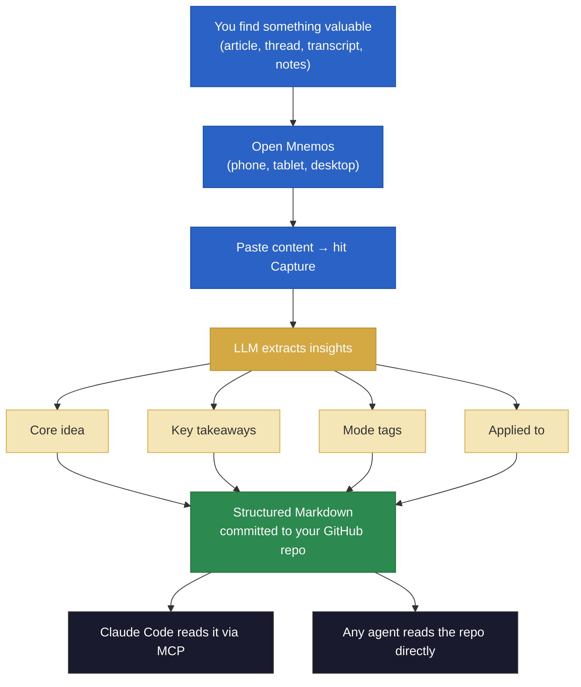

<p align="center">
  
</p>

<h1 align="center">Mnemos</h1>

<p align="center"><strong>Stop saving things you'll never apply.</strong></p>

Mnemos is a knowledge capture tool for builders who use AI agents. Paste any resource — an article, thread, transcript, or your own notes — and an LLM extracts the insight, tags where it applies, and commits it to a GitHub repo you own. Your AI tools (Claude Code, Codex, or any MCP-compatible agent) can then pull from that repo directly.

Every capture includes an **"Applied to"** field — a concrete connection between what you learned and what you're actually building. Knowledge doesn't sit in a saved-for-later graveyard. It feeds your workflows.

## How it works



## Get started

### 1. Sign up (30 seconds)

Go to **[mnemos-capture.vercel.app](https://mnemos-capture.vercel.app)** → **Sign in with GitHub**.

During setup, Mnemos will:

- Create a knowledge repo in your GitHub account (you own it — it's just Markdown files in a repo under your name)
- Ask for your Anthropic API key (this is your key, stored per-user — Mnemos never pays for your API calls)
- Set a PIN so you can unlock the app quickly on mobile

No config files. No CLI setup. No repos to clone.

### 2. Capture something

Open the app on any device — phone, tablet, or desktop. Paste any content and hit **Capture**.

The LLM reads your content and extracts:

- **Core idea** — the actual insight, not a generic summary
- **Key takeaways** — specific, opinionated, actionable points
- **Quotes** — only lines worth keeping verbatim
- **Mode tags** — where this applies in your life (career, work, founder, life)
- **Applied to** — one sentence connecting this to something you're building right now

The result is committed to your GitHub knowledge repo as a structured Markdown file.

### 3. Connect to Claude Code (optional)

After signing up, you get an API key. This lets you connect Mnemos to Claude Code so your agent can capture and search your knowledge without leaving the terminal.

Run this once:

```bash
claude mcp add mnemos -- npx mnemos-capture serve-mcp --key <your-api-key>
```

Now you can say things like:

- *"Capture this article about prompt caching"*
- *"What's in my inbox?"*
- *"Search my captures for evaluation frameworks"*

**What's happening under the hood:** `npx mnemos-capture serve-mcp` runs a lightweight local process that translates between Claude Code's stdio protocol and the Mnemos HTTP API. Your API key authenticates the requests. No data is stored locally — everything goes to your GitHub repo via the hosted app.

## Mobile access

Mnemos is a PWA (Progressive Web App). On your phone, open the app URL in your browser → Share → **Add to Home Screen**. It looks and feels like a native app — instant capture from anywhere.

## Why GitHub as storage?

Your knowledge lives in a repo you own. No proprietary database, no vendor lock-in. It's version-controlled, portable, and readable as plain Markdown. Clone it, search it, back it up — it's just files. And because it's a standard Git repo, any MCP-compatible agent or tool can read from it.

## Tech stack

Next.js · TypeScript (strict) · Anthropic SDK · GitHub OAuth · Vercel Postgres (Neon) · GitHub API · MCP protocol · Tailwind CSS

## Roadmap

- [ ] Multi-provider support (OpenAI, Google — schema is ready, extraction code needs updating)
- [ ] Batch capture (multiple resources at once)
- [ ] URL auto-fetch (paste a link, Mnemos fetches the content)
- [ ] Full-text search across knowledge hub
- [ ] Browser extension for one-click capture
- [ ] Settings page (change API key, repo, regenerate MCP key)
- [ ] Team knowledge hubs (shared captures)

## License

[MIT](LICENSE)
