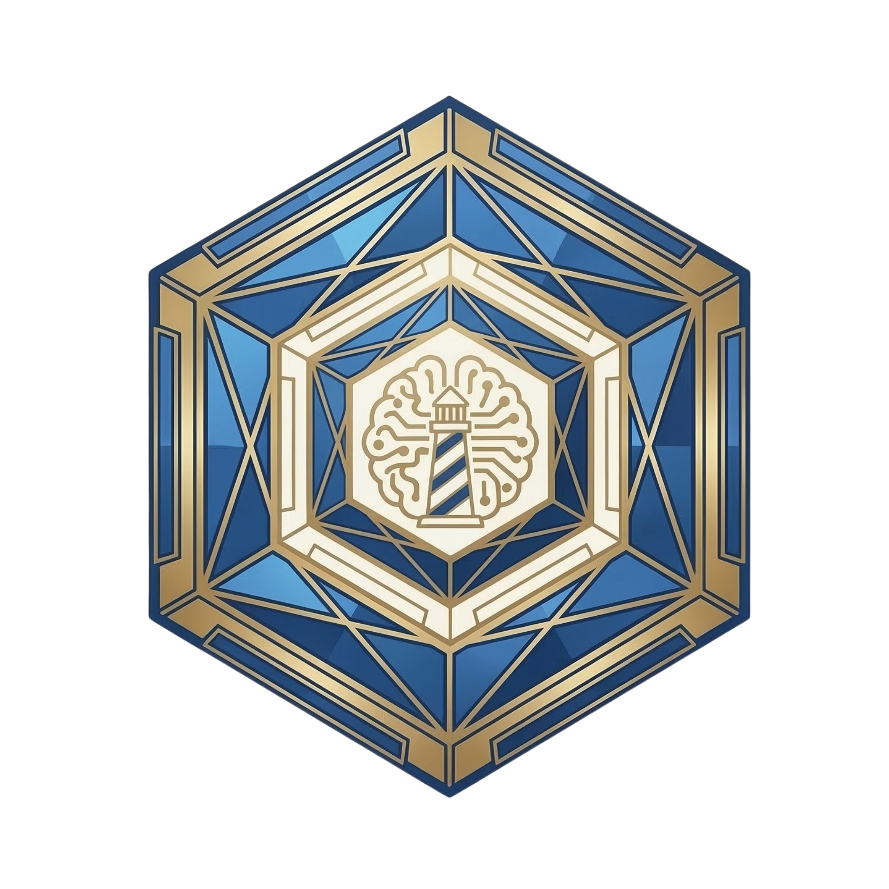
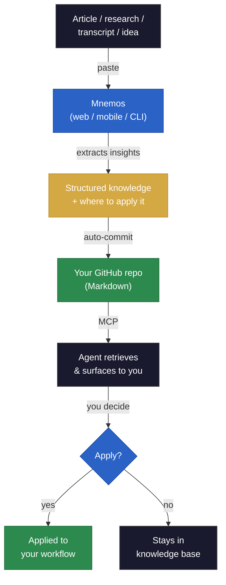

<p align="center">
  
</p>

<h1 align="center">Mnemos</h1>

<p align="center">
  
  
  
</p>

<p align="center"><strong>A knowledge pipeline for AI agents.<br />Capture anything — your agents retrieve and apply it.</strong></p>


<p align="center">Your agents only know what they were trained on. They don't know what you read this morning, what framework you found last week, or what idea you had at midnight.

Mnemos bridges that gap. It's a knowledge base that grows in real time and plugs directly into any agent via MCP — so every insight you capture is immediately available to every agent you use.</p>


## Get started

### 1. Sign up (30 seconds)

Go to **[mnemos-capture.vercel.app](https://mnemos-capture.vercel.app)** → **Sign in with GitHub**.

During setup, Mnemos will:

- Create a knowledge repo in your GitHub account — plain Markdown files, no proprietary format
- Ask for your Anthropic API key — your key, stored per-user, Mnemos never pays for your API calls
- Set a PIN so you can unlock the app quickly on mobile

No config files. No repos to clone. No CLI setup required.

### 2. Capture something

Open the app on any device — phone, tablet, or desktop. Paste any content and hit **Capture**.

The result is a structured Markdown file, auto-committed to your GitHub knowledge repo and immediately available to your agents.

### 3. Connect to Claude Code

After signing up, you get an MCP API key. Run this once in your project:

```bash
claude mcp add mnemos -- npx mnemos-capture serve-mcp --key <your-api-key>
```

Your agent confirms the connection and can immediately access your knowledge base.

> `npx mnemos-capture serve-mcp` runs a lightweight local process that bridges Claude Code to the Mnemos API. No data is stored locally — everything lives in your GitHub repo.

### 4. Connect to any MCP-compatible agent

Your knowledge lives in a standard GitHub repo. Any agent that can read Git or speak MCP can access it — no lock-in, no custom integration required.


## How it works



1. **You paste content** — an article, a research paper, a thread, a transcript, your own ideas. Anything text-based.
2. **Mnemos extracts the insight** — Claude Haiku 4.5 pulls the core idea (not a summary), identifies key takeaways, and tags where it could apply in your work. All automatic.
3. **It's committed to your repo** — a structured Markdown file lands in your GitHub knowledge repo, searchable and version-controlled.
4. **Your agents retrieve it** — Claude Code or any MCP-compatible agent can search your knowledge base and surface the right insight when it's relevant. You review, you decide what gets applied.

### Example output

Paste a research post about multi-agent systems. This is what gets committed to your repo:

```markdown
---
date: 2026-04-01
source: Why Multi-Agent Systems Outperform Single-Agent Loops
url: https://example.com/multi-agent-systems
type: post
tags: multi-agent, orchestration, agent-design, ai-architecture
status: inbox
---

# Why Multi-Agent Systems Outperform Single-Agent Loops

## Core idea
Decomposing complex tasks across specialized agents reduces error propagation
and improves output quality — a single orchestrator routing to focused subagents
consistently outperforms one generalist agent handling everything sequentially.

## Key takeaways
- Specialized agents outperform generalist agents on tasks requiring depth over breadth
- Parallel execution across subagents reduces total latency by 40-60% on multi-step tasks
- Orchestrator-subagent patterns improve error isolation — one agent failing doesn't
  collapse the entire workflow

## Quotes
> "The bottleneck in complex agentic tasks is not model capability — it's
> error propagation across sequential steps."

## Applied to
Evaluate your current single-agent workflows for tasks that could be decomposed
into parallel subagent calls — prioritize anything with 3+ sequential steps.
```

Every field is designed to help your agents find and apply the right knowledge at the right time. The **"Applied to"** field is the most important — it connects the insight to a concrete action in your work.


## What you can feed it

If it's text, Mnemos can extract insight from it. You don't need to categorize or tag anything yourself — that happens automatically.

- **Research papers and preprints** — new models, architectures, evaluation methods
- **Framework and library docs** — patterns, APIs, integration approaches worth keeping
- **Optimization techniques** — prompt engineering, caching strategies, latency improvements
- **Technical threads and writeups** — the argument or finding, not the noise
- **Your own ideas** — workflow improvements, architecture decisions, things you want your agents to act on later
- **Transcripts and talks** — the signal extracted, ready to apply


## Knowledge lifecycle

Knowledge that sits unreviewed rots. Mnemos forces a decision: apply it, save it for later, or discard it.

```
  ┌─────────┐
  │  Capture │
  └────┬─────┘
       ▼
  ┌─────────┐     ┌──────────┐
  │  Inbox   │────▶│  Applied  │   You used the insight in your workflow
  └────┬─────┘     └──────────┘
       │
       ├──────────▶┌──────────┐
       │           │ Archived  │   Reviewed, not actionable right now
       │           └──────────┘
       │
       └──────────▶┌──────────┐
                   │ Deleted   │   Not useful, permanently removed
                   └──────────┘
```

**How it works in practice:**

1. **Capture** — every new capture lands in `inbox/`. After each capture, Mnemos tells you how many items are waiting for review.
2. **Review** — use `list_inbox` to see what's in your inbox (with summaries), and `read_capture` to read the full content of any capture.
3. **Apply** — when you've used an insight (added it to a project file, changed a workflow, created a rule), use `apply_capture` to move it to `applied/`. This closes the loop — the knowledge is now part of your system.
4. **Archive** — reviewed it but it's not actionable right now? Use `archive_capture` to move it to `archived/`. It stays searchable but out of your inbox.
5. **Delete** — not useful? Use `delete_capture` to permanently remove it.

All captures are tracked in `INDEX.md` — a master table your agents use to search across your entire knowledge base.


## MCP tools

Mnemos exposes 7 tools via MCP, organized by what you're doing:

### Capture

| Tool | What it does |
|------|-------------|
| `capture` | Extracts insight from any pasted content and commits a structured Markdown file to your repo. This is the entry point — everything starts here. |

### Discover

| Tool | What it does |
|------|-------------|
| `list_inbox` | Shows your unprocessed captures with summaries — title, type, tags, and core idea. Up to 10 at a time. Use this to see what's waiting for your review. |
| `search_captures` | Searches your knowledge base by keyword or tag. Finds relevant captures across inbox, applied, and archived — so your agent can pull the right knowledge when it's needed. |
| `read_capture` | Reads the full Markdown of any capture. Use this to see the complete insight, takeaways, and context before deciding what to do with it. |

### Manage

| Tool | What it does |
|------|-------------|
| `apply_capture` | Moves a capture from inbox to applied. Marks it as used — you can add a note about where you applied it (e.g., "Added as a rule in CLAUDE.md"). |
| `archive_capture` | Moves a capture from inbox to archived. It's been reviewed but isn't actionable right now. Stays searchable, out of your inbox. |
| `delete_capture` | Permanently removes a capture and its index entry. For mistakes or captures that aren't useful. |

The web UI and MCP use the same pipeline. The web UI is for capturing on the go. MCP is for your agents — they retrieve and manage captures without you touching the browser.


## Mobile

Open Mnemos in your phone's browser, tap **Share → Add to Home Screen**. It runs full-screen like a native app.

Capture on the go — reading an article on your phone at lunch? Capture it. Your agents have it by the time you sit down to work.

## Your data, your storage

Your knowledge lives in a GitHub repo you own. Plain Markdown files, version-controlled, portable.

- **No lock-in** — clone it, search it, move it, delete Mnemos tomorrow and your repo stays exactly where it is
- **No proprietary format** — every capture is a readable `.md` file
- **No training on your data** — Mnemos never reads your captures for any purpose other than serving them back to you and your agents
- **Any tool can access it** — anything that reads Git or speaks MCP works with your knowledge base


## Cost

Mnemos uses your own Anthropic API key (BYOK). You bring your key, Mnemos never charges you for API calls.

Extraction runs on **Claude Haiku 4.5** with prompt caching and input truncation, optimized for minimal token usage:

| Usage | Estimated monthly cost |
|-------|----------------------|
| 50 captures/month | ~$0.15 |
| 100 captures/month | ~$0.30 |
| 200 captures/month | ~$0.60 |

Less than $1/month for heavy use.


## Tech stack

Next.js · TypeScript · Claude Haiku 4.5 · Anthropic SDK · GitHub OAuth · Vercel Postgres · GitHub Content API · MCP protocol · Tailwind CSS

## Roadmap

- Chrome extension for one-click capture from anywhere in the browser
- URL auto-fetch — paste a link, Mnemos fetches and extracts
- Multi-provider support (OpenAI, Google — schema is ready)
- Voice memo capture


## Built by

[Soph](https://github.com/Soph20) — builder, AI systems architect. 


## License

[MIT](./LICENSE)
