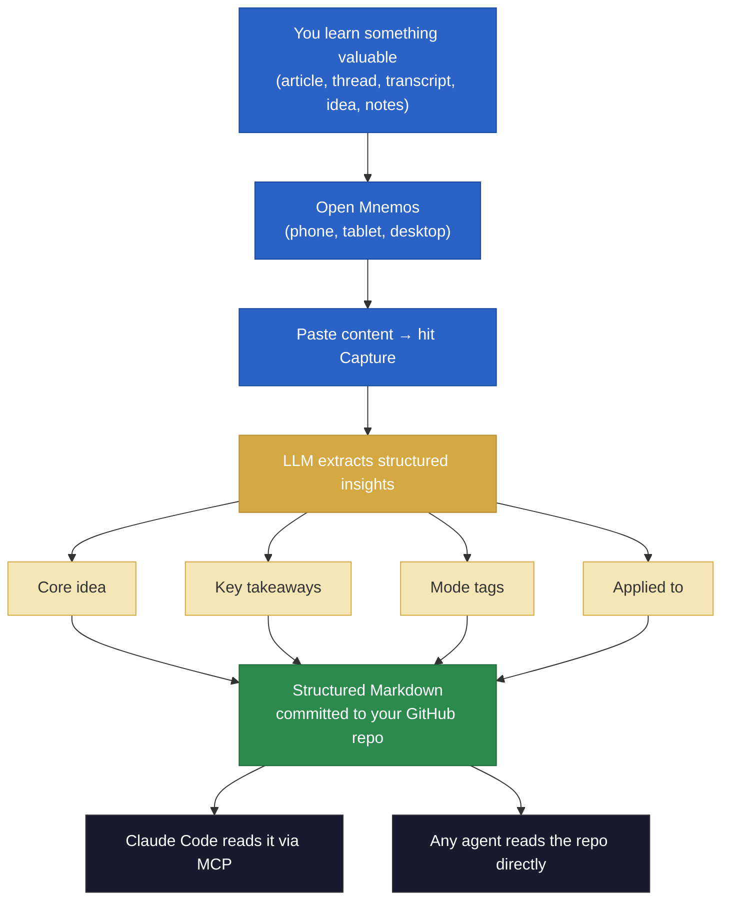

<p align="center">
  
</p>

<h1 align="center">Mnemos</h1>

<p align="center"><strong>Capture knowledge. Apply it through your agents.</strong></p>

Mnemos is a knowledge pipeline for builders who work with AI agents. You learn something — an article, a thread, a transcript, your own notes, an idea on the go — and instead of bookmarking it or letting it rot in a tab, you paste it into Mnemos. An LLM extracts the core insight, tags where it applies, and commits it to a GitHub repo you own.

That repo becomes your personal knowledge base. Your AI agents — Claude Code, Codex, or any MCP-compatible tool — pull from it directly. The knowledge you captured on your phone during lunch is available to your coding agent by the time you sit down to work.

**This is not a note-taking app.** It's a bridge between what you learn and what your agents do.

## Why Mnemos exists

Most knowledge tools stop at "save it." Mnemos closes the loop:

1. **You capture** — paste anything: articles, threads, transcripts, meeting notes, ideas, voice memo transcripts, book highlights
2. **AI extracts** — an LLM pulls the actual insight (not a summary), tags it by context, and connects it to what you're building right now
3. **Your agents apply it** — Claude Code, Codex, or any agentic tool reads your knowledge repo via MCP or Git and uses it in real workflows

Every capture includes an **"Applied to"** field — a concrete sentence linking what you learned to what you're building. This is the difference between a saved-for-later graveyard and a knowledge system that compounds.

## How it works



## What you can capture

Mnemos handles any text-based input. Paste it, and the LLM figures out the format and extracts accordingly.

- **Articles and blog posts** — the insight, not a summary
- **Twitter/X threads** — the argument stitched together
- **Podcast and meeting transcripts** — the signal, not the filler
- **Your own notes and ideas** — raw thoughts turned into structured knowledge
- **Book highlights and excerpts** — the quotes and frameworks worth keeping
- **Newsletter and Substack posts** — the actionable takeaways

Coming soon: voice memos, URL auto-fetch, and browser extension for one-click capture.

## What the LLM extracts

Every capture produces a structured Markdown file with:

- **Core idea** — the actual insight, not "this article discusses X"
- **Key takeaways** — 3-5 specific, opinionated assertions that pass the "so what?" test
- **Quotes** — only verbatim lines worth keeping. None if nothing is genuinely quotable
- **Mode tags** — where this applies (career, work, founder, life)
- **Applied to** — one sentence connecting this to something you're building right now
- **Low confidence flag** — alerts you when input is too short or ambiguous for reliable extraction

## Cost

Mnemos uses your own Anthropic API key (BYOK model — you bring your own key, Mnemos never charges you).

Extraction runs on **Claude Haiku 4.5** with prompt caching and input truncation, optimized for minimal token usage:

| Usage | Estimated monthly cost |
|-------|----------------------|
| 50 captures/month (casual) | ~$0.15 |
| 100 captures/month (regular) | ~$0.30 |
| 200 captures/month (heavy) | ~$0.60 |

That's less than $1/month for heavy use. For comparison, the same workload on a larger model without optimization would cost 5-6x more.

## Get started

### 1. Sign up (30 seconds)

Go to **[mnemos-capture.vercel.app](https://mnemos-capture.vercel.app)** → **Sign in with GitHub**.

During setup, Mnemos will:

- Create a knowledge repo in your GitHub account (you own it — just Markdown files in a repo under your name)
- Ask for your Anthropic API key (your key, stored per-user — Mnemos never pays for your API calls)
- Set a PIN so you can unlock the app quickly on mobile

No config files. No CLI setup. No repos to clone.

### 2. Capture something

Open the app on any device — phone, tablet, or desktop. Paste any content and hit **Capture**. That's it.

The result is auto-committed to your GitHub knowledge repo as a structured Markdown file.

### 3. Connect to Claude Code (optional)

After signing up, you get an API key. This connects Mnemos to Claude Code so your agent can capture and search your knowledge without leaving the terminal.

Run this once:

```bash
claude mcp add mnemos -- npx mnemos-capture serve-mcp --key <your-api-key>
```

Now you can say things like:

- *"Capture this article about prompt caching"*
- *"What's in my inbox?"*
- *"Search my captures for evaluation frameworks"*

**Under the hood:** `npx mnemos-capture serve-mcp` runs a lightweight local process that bridges Claude Code's stdio protocol to the Mnemos HTTP API. Your API key authenticates the requests. No data is stored locally — everything goes to your GitHub repo via the hosted app.

## Mobile access

Mnemos is a PWA. On your phone, open the app URL in your browser → Share → **Add to Home Screen**. Native-app feel, instant capture from anywhere.

## Why GitHub as storage?

Your knowledge lives in a repo you own. No proprietary database, no vendor lock-in. It's version-controlled, portable, and readable as plain Markdown. Clone it, search it, back it up — it's just files. And because it's a standard Git repo, any MCP-compatible agent or tool can read from it directly.

## Tech stack

Next.js · TypeScript (strict) · Anthropic SDK · GitHub OAuth · Vercel Postgres (Neon) · GitHub API · MCP protocol · Tailwind CSS

## Roadmap

- [ ] Multi-provider support (OpenAI, Google — schema is ready)
- [ ] Voice memo capture
- [ ] URL auto-fetch (paste a link, Mnemos fetches the content)
- [ ] Batch capture (multiple resources at once)
- [ ] Browser extension for one-click capture
- [ ] Full-text search across knowledge hub
- [ ] Custom user-defined modes
- [ ] Settings page (change API key, repo, regenerate MCP key)
- [ ] Team knowledge hubs (shared captures)

## License

[MIT](LICENSE)
