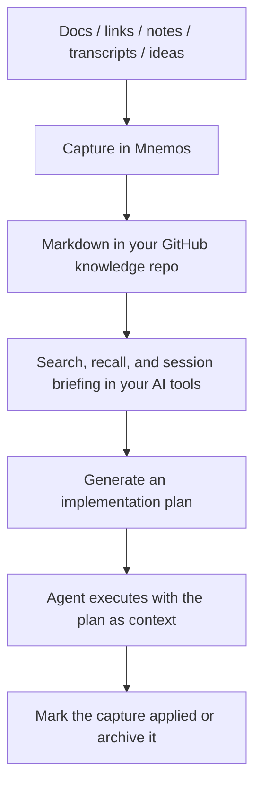

<p align="center">
  
</p>

<h1 align="center">Mnemos</h1>

<p align="center">
  
  
  
</p>

<p align="center"><strong>Turn what you learn into knowledge your AI agents can use.</strong></p>

<p align="center">
  Mnemos helps builders who use AI agents turn the information they consume into knowledge their agents can use to ship better work.<br />
  Humans consume information. Agents execute it. Mnemos is the bridge.
</p>

---

## Why Mnemos exists

AI agents are useful, but they forget everything that is not in the prompt, the codebase, or their training data.

The problem: builders read, decide, research, and learn every day, but that information rarely becomes reusable context for their agents.

That means agents usually do not know:

- the article you read this morning
- the framework decision your team made last sprint
- the debugging pattern that worked last week
- the product insight you want applied in the next build
- the internal rule that should shape every implementation

Mnemos is the hub between those two worlds.

Capture something once. Mnemos turns it into structured Markdown, stores it in a GitHub repo you own, indexes it, and makes it available to your AI agents through MCP-compatible connectors and Mnemos integrations. Your agent can then search it, read it, get a project-specific briefing, generate an implementation plan, and mark the knowledge as applied when the work is done.

**So what?** Your agents start with the right context, reuse what you already learned, and turn saved knowledge into concrete plans.

<p align="center"><sub>Works with <strong>Claude Code</strong> · <strong>Claude Desktop</strong> · <strong>Codex CLI</strong> · <strong>Cursor</strong> · <strong>Gemini CLI</strong> · and other MCP-compatible tools.</sub></p>

## What Mnemos does

Mnemos is a personal knowledge hub for builders who use AI agents.

It helps you:

1. **Capture** useful knowledge from notes, links, docs, papers, transcripts, and ideas.
2. **Store** every capture as plain Markdown in your own GitHub repo.
3. **Find** relevant knowledge from an MCP client using keyword and semantic search.
4. **Brief** your agent at the start of a work session with the captures that matter for the current repo and branch.
5. **Plan** implementation work from selected captures.
6. **Apply** captures so your knowledge base reflects what actually changed.

Mnemos is not trying to be a second brain dashboard. It is built for one job: **bridge human learning and agent execution.**

## Who it is for

Mnemos is useful if you:

- build with coding agents and want them to remember more than the current prompt
- collect technical research, docs, examples, and product ideas
- want your knowledge in Git instead of a closed database
- need repeatable rules and implementation plans, not just saved bookmarks
- work across multiple AI tools and want the same knowledge available everywhere MCP is supported

## Quick start

### 1. Create your Mnemos account

Go to **[mnemos-capture.vercel.app](https://mnemos-capture.vercel.app)** and sign in with GitHub.

During onboarding, Mnemos will ask you to:

1. create a private GitHub knowledge repo, or opt into a public one
2. add your LLM provider API key
3. set a local device PIN for quick unlocks
4. copy your MCP API key if you want to use the local stdio proxy

Your knowledge repo uses Markdown files. You can clone it, inspect it, move it, or delete Mnemos and keep the files. You do not initialize a database or run backend setup to use the hosted app.

### 2. Connect your AI assistant

Mnemos supports two MCP connection methods.

Use the remote connector when your client supports remote MCP over HTTP. Use the local stdio proxy when your client can launch a local command.

| Method | Best for | What you need |
|---|---|---|
| Remote connector | Claude apps, clients with remote MCP support, OpenAI Responses API MCP tool | The Mnemos MCP URL |
| Local stdio proxy | Claude Code, Cursor, Continue, Windsurf, Cline, Zed, Codex CLI, Gemini CLI, and other command-based MCP clients | Your Mnemos MCP API key |

#### Option A: Remote connector

Use this URL in your MCP client:

```text
https://mnemos-capture.vercel.app/api/mcp
```

For Claude apps, add it as a custom connector. Mnemos will open a GitHub sign-in and ask you to approve access.

#### Option B: Local stdio proxy

Use this command in any MCP client that supports local command servers:

```bash
npx -y mnemos-capture@latest serve-mcp --key <your-mcp-key>
```

For Claude Code:

```bash
claude mcp add mnemos -- npx -y mnemos-capture@latest serve-mcp --key <your-mcp-key>
```

For Claude Desktop, add this to `claude_desktop_config.json`, then fully restart Claude Desktop:

```json
{
  "mcpServers": {
    "mnemos": {
      "command": "npx",
      "args": ["-y", "mnemos-capture@latest", "serve-mcp", "--key", "<your-mcp-key>"]
    }
  }
}
```

### 3. Capture something

Open the app and paste a note, link, transcript, doc excerpt, or idea.

You can also capture from an MCP-connected assistant:

```text
capture "The Mom Test: do not ask if your idea is good. Ask about the person's real behavior, current workflow, and past spending."
```

Mnemos extracts the useful idea, adds metadata, commits a Markdown file to your knowledge repo, and updates the index.

## Example capture

Input:

```text
The Mom Test: do not ask if your idea is good. Ask about the person's real behavior, current workflow, and past spending.
```

Saved Markdown:

```markdown
---
date: 2026-06-05
source: The Mom Test note
type: note
source_type: note
tags: customer-discovery, product, research
status: inbox
lowConfidence: false
---

# The Mom Test note

## Core idea
Do not ask people to judge your idea. Ask about their real life, recent behavior, current workaround, and what they have already tried or paid for.

## Key takeaways
- Avoid compliments and future promises
- Ask about specific past behavior
- Look for existing pain, workarounds, and spending

## Applied to
Use this when writing discovery interview scripts, landing page tests, and product validation prompts.
```

## How the workflow fits together


```mermaid
flowchart TD
    A["Docs / links / notes / transcripts / ideas"] --> B["Capture in Mnemos"]
    B --> C["Markdown in your GitHub knowledge repo"]
    C --> D["Search, recall, and session briefing in your AI tools"]
    D --> E["Generate an implementation plan"]
    E --> F["Agent executes with the plan as context"]
    F --> G["Mark the capture applied or archive it"]
```

1. **Capture** — Mnemos extracts the core idea, takeaways, tags, and suggested use.
2. **Store** — the result is committed as Markdown to your GitHub knowledge repo.
3. **Retrieve** — agents can list, search, recall, and read captures through MCP-compatible connectors and Mnemos integrations.
4. **Brief** — Mnemos can suggest what matters for the current repo and branch.
5. **Plan** — selected captures can become a concrete implementation plan.
6. **Apply** — mark captures as applied, archive them, or delete them.

## MCP tools

Mnemos exposes 15 MCP tools.

| Category | Tools | Purpose |
|---|---|---|
| Capture | `capture` | Save new knowledge from pasted text or a URL. |
| Discover | `list_inbox`, `search_captures`, `read_capture`, `recall` | Find and read saved knowledge. |
| Apply | `apply_capture`, `archive_capture`, `delete_capture`, `apply_to_context` | Use, clean up, or contextualize captures. |
| Plan | `briefing`, `generate_plan`, `list_plans` | Turn selected captures into project-specific plans. |
| Synthesize | `synthesize`, `get_rules` | Distill repeated captures into reusable rules. |
| Curate | `curate`, `vault_scan` | Review stale captures and surface relevant knowledge before edits. |

## Session hooks

For Claude Code, the local proxy can install hooks that surface Mnemos context automatically.

Install a basic inbox reminder:

```bash
npx -y mnemos-capture@latest setup-hooks --key <your-mcp-key>
```

Install a session briefing:

```bash
npx -y mnemos-capture@latest setup-hooks --key <your-mcp-key> --briefing
```

Install vault mode, which checks for relevant captures before file edits:

```bash
npx -y mnemos-capture@latest setup-hooks --key <your-mcp-key> --vault
```

Hook support depends on the client.

| Surface | Hook support |
|---|---|
| Claude Code CLI, VS Code extension, JetBrains extension, desktop app | Yes |
| Claude Code on the web | No. Hooks are local files. |
| Cursor and other MCP clients | No. They use different hook systems. |

MCP tools still work without hooks. If your client does not support hooks, tell it to call `list_inbox` or `briefing` at the start of a session.

## CLI

Run commands through `npx`:

```bash
npx -y mnemos-capture@latest <command>
```

Available commands:

```text
mnemos-capture                                      Open the hosted app
mnemos-capture serve-mcp --key KEY                 Run the local MCP proxy
mnemos-capture setup-hooks --key KEY [--briefing] [--vault]
                                                    Install Claude Code hooks
mnemos-capture inbox-check --key KEY [--briefing]  Debug the session hook output
mnemos-capture vault-check --key KEY               Debug the vault hook output
mnemos-capture help                                Show help
```

## Data ownership and security

Your knowledge lives in a GitHub repository that you own.

- **Private by default** — Mnemos creates a private repo unless you choose public.
- **Plain Markdown** — no proprietary export format.
- **Portable** — clone the repo or use the files without Mnemos.
- **Version-controlled** — every capture is visible in Git history.
- **BYOK** — you use your own LLM provider key.
- **Revocable** — rotating your MCP key invalidates old MCP clients and sessions.

Mnemos stores credentials safely:

| Secret | Storage |
|---|---|
| GitHub token | Encrypted at rest with AES-256-GCM. The token needs `repo` scope to read and write a private knowledge repo. |
| LLM API key | Encrypted at rest with AES-256-GCM. |
| MCP API key | Hashed. Mnemos cannot show it again after creation. |
| PIN | Salted scrypt hash. |

The PIN is only a quick unlock for a device that already signed in with GitHub. It is not a standalone password.

## Cost

Mnemos is bring-your-own-key. You pay your LLM provider directly for inference.

Extraction uses a fast, low-cost model by default and keeps inputs bounded.

| Usage | Estimated monthly inference cost |
|---|---|
| 50 captures/month | About $0.15 |
| 100 captures/month | About $0.30 |
| 200 captures/month | About $0.60 |

Briefing, planning, synthesis, and other agent-facing tools only run when you call them.

## Tech stack

- Next.js
- TypeScript
- Vercel Postgres
- GitHub OAuth
- GitHub Content API
- MCP protocol
- Anthropic SDK
- Tailwind CSS
- Vitest
- Playwright

## Roadmap

Shipped:

- hosted web capture app
- GitHub-backed Markdown knowledge repo
- remote MCP connector
- local stdio MCP proxy
- provider-agnostic BYOK support for Anthropic, OpenAI, and Google
- Claude Code session hooks
- `mnemos kos` orchestrator for plan-based agent execution in an isolated worktree

Planned:

- Chrome extension for one-click browser capture
- more per-tool integrations for assistants without MCP support
- voice memo capture with transcription
- one Mnemos gateway key for routing across providers
- `kos` improvements, including per-step model selection and detached background runs

## Built by

[Sofía Padrón Valdez](https://github.com/Soph20) — builder and AI systems architect.

## Citation

```bibtex
@misc{2026mnemos,
  title        = {Mnemos: A Knowledge Pipeline for AI Agents},
  author       = {Sofia Padron Valdez},
  year         = 2026,
  journal      = {GitHub repository},
  publisher    = {GitHub},
  howpublished = {\url{https://github.com/Soph20/mnemos-capture}}
}
```

## License

[MIT License - see LICENSE file for details](./LICENSE)
