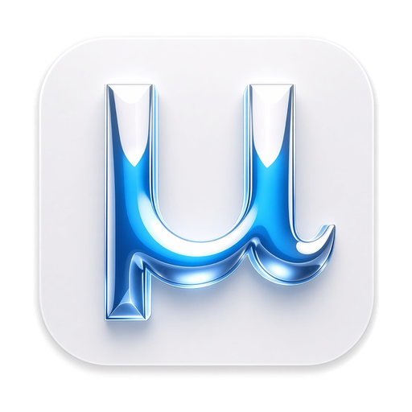
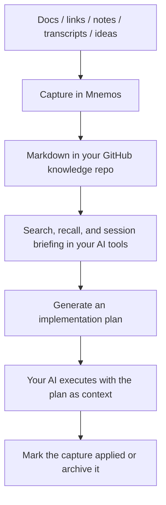

<p align="center">
  
</p>

<h1 align="center">Mnemos</h1>

<p align="center">
  
  
  
</p>

<p align="center"><strong>Turn what you discover into context your AI can use.</strong></p>

<p align="center">
  You find useful stuff. Mnemos makes sure your AI can use it later.<br />
  A paper, a doc, a GitHub repo, a note, an idea — capture it once.
</p>

```text
Discover → Capture → Brief → Plan → Execute
```

<p align="center"><sub>Works with <strong>Claude</strong> · <strong>Claude Code</strong> · <strong>Cursor</strong> · <strong>Codex</strong> · <strong>Gemini CLI</strong> · <strong>VS Code</strong> · and any MCP-compatible tool.</sub></p>

---

## Why Mnemos?

AI moves fast. New research, models, tools, and how-tos show up every day.

You save the useful ones. Then they disappear into notes, bookmarks, tabs, or chat history.

**The problem isn't finding information. It's putting what you learn to work.**

Your AI only knows what it was trained on, what's in the current prompt, and what's in the repo you opened. It doesn't know the article you read this morning, the decision you made last sprint, or the pattern that finally worked.

Mnemos is the bridge.

Capture something once. Mnemos turns it into structured Markdown, stores it in a GitHub repo you own, and makes it available to the AI tools you already use.

---

## Start here

You do not need a terminal to start.

### 1. Create your account

Open **[mnemos-capture.vercel.app](https://mnemos-capture.vercel.app)** and sign in with GitHub.

Mnemos will:

1. Create a **private** GitHub repo for your knowledge (you can opt to make it public)
2. Ask for your LLM provider API key — Anthropic, OpenAI, or Google. Your key, your cost.
3. Let you set a PIN (6+ characters) for quick unlock on this device
4. Show your **Mnemos API key** once — save it if you want to connect a coding tool

That's the whole setup. No repo to clone. No database. No CLI required.

### 2. Capture something

In the app, paste a URL, a note, a doc excerpt, a transcript, or an idea, then hit **Capture**.

Mnemos extracts:

- **Core idea**
- **Key takeaways**
- **Where to apply it**
- **Capture type**

and commits it to your GitHub repo as Markdown.

You can do this from your laptop or your phone. On a phone: open the app → **Share → Add to Home Screen**. It runs like a native app.

### 3. Connect the AI you already use

Pick the path that matches your tool. Same knowledge, same tools, either way.

| If you use… | Do this | You need |
|---|---|---|
| **Claude** (web, desktop, iOS, Android) | Add Mnemos as a custom connector. No terminal. | The MCP URL below |
| **Claude Code** | Remote URL, or one local command | The MCP URL, or your API key |
| **Cursor, Codex, Gemini CLI, VS Code, Windsurf, Cline, Zed** | Add Mnemos as a local MCP server | Your Mnemos API key |
| **Just the Mnemos app for now** | Skip this step. Capture today, connect an AI later. | Nothing else |

---

## Connect your AI

MCP is how AI tools talk to Mnemos. You connect once. After that, your AI can search, brief, plan, and apply what you've captured.

### Claude — custom connector (easiest, no terminal)

In Claude:

1. Open **Settings → Connectors**
2. Select **Add custom connector**
3. Name it `Mnemos`
4. Paste this URL:

```text
https://mnemos-capture.vercel.app/api/mcp
```

5. Sign in with GitHub when Claude asks, and approve access

Claude can now use your captures. Finish Mnemos onboarding (knowledge repo + LLM key) before connecting.

> Only connect MCP servers you trust. Anthropic does not control the tools provided by custom connectors. [Learn more](https://support.anthropic.com/en/articles/11175166-about-custom-integrations-using-remote-mcp)

ChatGPT / the OpenAI Responses API MCP tool can use the same URL.

### Claude Code

**Option A — remote (no API key to paste):**

```bash
claude mcp add --transport http mnemos https://mnemos-capture.vercel.app/api/mcp
```

**Option B — local command (uses your Mnemos API key):**

```bash
claude mcp add mnemos -- npx -y mnemos-capture@latest serve-mcp --key YOUR_API_KEY
```

Then start Claude Code. Ask it to `list_inbox` or `briefing` to confirm the connection.

### Cursor, Codex, Gemini CLI, VS Code, Windsurf, and other MCP clients

If your tool can launch a local MCP server, register this command:

```bash
npx -y mnemos-capture@latest serve-mcp --key YOUR_API_KEY
```

Most clients accept a config block like this:

```json
{
  "mcpServers": {
    "mnemos": {
      "command": "npx",
      "args": ["-y", "mnemos-capture@latest", "serve-mcp", "--key", "YOUR_API_KEY"]
    }
  }
}
```

**Claude Desktop:** Settings → Developer → Edit Config, add the block to `claude_desktop_config.json`, then fully restart Claude Desktop.

Use **Option A (the URL)** when the client supports remote MCP. Use **Option B (the command)** when it can launch a local process. If the tool has no MCP support yet, capture in the [Mnemos app](https://mnemos-capture.vercel.app) and connect later — a Chrome extension is on the roadmap for those surfaces.

---

## The Mnemos workflow

```text
Discover → Capture → Brief → Plan → Execute
```


```mermaid
flowchart TD
    A["Docs / links / notes / transcripts / ideas"] --> B["Capture in Mnemos"]
    B --> C["Markdown in your GitHub knowledge repo"]
    C --> D["Search, recall, and session briefing in your AI tools"]
    D --> E["Generate an implementation plan"]
    E --> F["Your AI executes with the plan as context"]
    F --> G["Mark the capture applied or archive it"]
```

### 1. Capture

Paste anything text-based:

- Research papers and docs
- Blog posts and tutorials
- GitHub repos
- Technical notes and architecture decisions
- Ideas you want your AI to act on later
- Transcripts and talks

Mnemos detects whether you pasted a URL, a short note, or longer text. No manual tagging required.

You can also capture from a connected AI:

```text
capture "The Mom Test: don't ask if your idea is good. Ask about the person's real behavior, current workflow, and past spending."
```

### 2. Brief

At the start of a work session, ask your AI for a briefing — or install the Claude Code hook below.

Mnemos looks at your project (branch, recent commits, `CLAUDE.md`, repo context) and ranks captures that could help now:

- **Why** this insight matters
- **What** applying it could achieve
- **Where** it could land in the codebase

You decide what to apply.

### 3. Plan

Select the captures you want to use and ask your AI to call `generate_plan`.

Each plan is Markdown and includes:

- **Codebase mapping** — files and components involved
- **Implementation steps** with effort tiers: `simple`, `complex`, `architectural`
- **Verification checklist** — what to run when the work is done

### 4. Execute

Hand the plan to your AI in the current session, or run it in an isolated git worktree:

```bash
npx -y mnemos-capture@latest config set agent "claude -p"
npx -y mnemos-capture@latest kos --key YOUR_API_KEY
```

`kos` creates a worktree, loads the plan as the contract, launches the assistant you configured, and prints the verification checklist when it finishes.

Other assistants work the same way:

```bash
npx -y mnemos-capture@latest config set agent "codex exec"
```

```text
Research → Capture → Brief → Plan → AI agent → Code → Verification
```

**From discovery to practice.**

---

## Example capture

Input:

```text
The Mom Test: don't ask if your idea is good. Ask about the person's real behavior, current workflow, and past spending.
```

Saved to your GitHub repo:

```markdown
---
date: 2026-06-05
source: The Mom Test note
type: note
tags: customer-discovery, product, research
status: inbox
---

# The Mom Test

## Core idea

Do not ask people to judge your idea. Ask about their real life,
recent behavior, current workaround, and what they have already
tried or paid for.

## Key takeaways

- Avoid compliments and future promises
- Ask about specific past behavior
- Look for existing pain, workarounds, and spending

## Where to apply

Discovery interview scripts, landing page tests, and product
validation prompts.
```

Because it's Markdown:

- You can read it yourself
- You can edit it with any editor
- Git tracks every change
- You can clone the repository
- Your context isn't locked into a proprietary format

---

## MCP tools

Once connected, your AI can use these tools. You don't have to memorize them — just ask in plain language ("save this", "what do I have on payments?", "brief me for this repo").

| Tool | What it does |
|---|---|
| `capture` | Save new knowledge from pasted text or a URL |
| `list_inbox` | List captures waiting for review |
| `search_captures` | Keyword search across your captures |
| `read_capture` | Read a capture in full |
| `recall` | Find relevant context from a description of your task |
| `briefing` | Get project-specific recommendations |
| `generate_plan` | Turn selected captures into an implementation plan |
| `list_plans` | List or read saved plans |
| `apply_capture` | Mark a capture as applied |
| `archive_capture` | Archive a capture |
| `delete_capture` | Delete a capture |
| `apply_to_context` | Get file-level suggestions for the current task |
| `synthesize` | Combine related captures into reusable rules |
| `get_rules` | Retrieve those rules |
| `curate` | Review and clean up captures |
| `vault_scan` | Find relevant context for what you're about to edit |

---

## Claude Code hooks

Optional. MCP works without them. Hooks automatically bring your context into Claude Code.

**Session briefing** — ranked captures at session start:

```bash
npx -y mnemos-capture@latest setup-hooks --key YOUR_API_KEY --briefing
```

**Vault** — relevant captures as you edit files:

```bash
npx -y mnemos-capture@latest setup-hooks --key YOUR_API_KEY --vault
```

**Both:**

```bash
npx -y mnemos-capture@latest setup-hooks --key YOUR_API_KEY --briefing --vault
```

| Surface | Hooks work? |
|---|---|
| Claude Code CLI, VS Code / JetBrains extensions, desktop app | Yes |
| Claude Code on the web | No — hooks are local files |
| Cursor and other MCP clients | No — different hook systems |

If hooks aren't available, tell your AI: *At session start, call `list_inbox` or `briefing`.*

---

## CLI

You don't need a global install:

```bash
npx -y mnemos-capture@latest <command>
```

```text
npx -y mnemos-capture@latest
    Open the hosted app

npx -y mnemos-capture@latest serve-mcp --key YOUR_API_KEY
    Run the local MCP proxy

npx -y mnemos-capture@latest setup-hooks --key YOUR_API_KEY [--briefing] [--vault]
    Install Claude Code hooks

npx -y mnemos-capture@latest config set agent "claude -p"
    Set which assistant kos should drive

npx -y mnemos-capture@latest kos --key YOUR_API_KEY
    Implement the latest plan in an isolated worktree

npx -y mnemos-capture@latest inbox-check --key YOUR_API_KEY [--briefing]
    Debug the session hook

npx -y mnemos-capture@latest vault-check --key YOUR_API_KEY
    Debug the vault hook

npx -y mnemos-capture@latest help
    Show help
```

---

## Your context stays in GitHub

Mnemos stores captures as structured Markdown in **your** GitHub repository. Private by default.

- **No lock-in** — clone it, move it, delete Mnemos, keep the files
- **No proprietary format** — every capture is a readable `.md` file
- **No training on your data** — captures are sent only to the LLM provider you chose, with the key you supplied, to extract the insight you asked for
- **Any tool can read it** — anything that reads Git or speaks MCP
- **BYOK** — your provider, your key, your cost
- **Never commit your Mnemos API key** to source control

## What Mnemos stores, and where

The whole point of this repo being public is that you can check these claims rather than trust them.

**Your captures are never stored by Mnemos.** They are written straight to your own GitHub repo as Markdown (`src/lib/github.ts`). There is no captures table. Delete the app and your knowledge is untouched.

**The database holds only account plumbing** (`src/lib/db.ts`):

| Stored | What it is |
|---|---|
| `github_id`, `github_username` | who you are |
| `github_token` | encrypted (`src/lib/crypto.ts`) |
| `github_repo` | the *name* of your hub, not its contents |
| `pin_hash` | salted scrypt (`src/lib/pin.ts`) |
| `api_key` | hashed — not recoverable |
| `llm_provider`, `llm_api_key` | encrypted |
| `token_version` | bumped to revoke everything |
| login attempts, OAuth clients/codes, refresh-token ids | auth plumbing |

**Where data goes when you capture** — the server talks to exactly three kinds of destination:

1. **GitHub** — to write the capture into your repo
2. **Your LLM provider**, with *your* key — Anthropic, OpenAI, or Google
3. **The page you captured** — if you paste a bare URL, so the model reads real content. Only http/https, never an internal address

No analytics, no telemetry, no third-party tracking.

### How your credentials are stored

| Secret | How it's stored |
|---|---|
| GitHub token | Encrypted at rest (AES-256-GCM). Uses the `repo` scope, required to read and write a **private** knowledge hub |
| Your LLM API key | Encrypted at rest (AES-256-GCM) |
| Your MCP API key | Hashed — never recoverable, not even by Mnemos |
| Your PIN | Salted scrypt hash |

Your MCP key is shown exactly once. If you lose it, generate a new one.

**PIN unlock is device-bound.** It only works on a device that has already signed in with GitHub. A PIN on its own is not enough to reach your account.

**Revoking access.** Generating a new MCP key invalidates the old key, every signed-in session, and every connected MCP client. Sessions also expire after 30 days.

---

## Cost

Mnemos is BYOK — you bring your own API key. Mnemos never charges you for inference.

Extraction runs on a fast, low-cost model (Claude Haiku 4.5 by default):

| Usage | Estimated monthly cost |
|---|---|
| 50 captures/month | ~$0.15 |
| 100 captures/month | ~$0.30 |
| 200 captures/month | ~$0.60 |

Briefing, planning, and synthesis only run when you ask for them.

---

## Roadmap

Shipped:

- Hosted web + PWA capture app
- GitHub-backed Markdown knowledge repo
- Remote MCP connector (Claude apps, ChatGPT / OpenAI Responses API)
- Local stdio MCP proxy (Claude Code, Cursor, Codex, Gemini CLI, …)
- Provider-agnostic BYOK (Anthropic, OpenAI, Google)
- Claude Code session hooks
- `kos` orchestrator for plan-based execution in an isolated worktree

Planned:

- **Chrome extension** — one-click capture from any tab
- More adapters for assistants that don't speak MCP yet
- Voice memo capture with transcription
- One Mnemos gateway key that routes across providers
- `kos` improvements: per-step model switching and `--detach` background runs

---

## Local development

You do not need to run Mnemos to use it — the hosted instance at
[mnemos-capture.vercel.app](https://mnemos-capture.vercel.app) is the supported way in. This section is
for working on the code.

**Prerequisites**

| | |
|---|---|
| Node.js | 20.9 or later (Next.js 16 requires it) |
| PostgreSQL | any reachable instance — local, Neon, or Vercel Postgres |
| GitHub OAuth app | [create one](https://github.com/settings/developers) with callback `http://localhost:3000/api/auth/callback` |

**Setup**

```bash
git clone https://github.com/Soph20/mnemos-capture.git
cd mnemos-capture
npm ci
cp .env.example .env
```

Fill in `.env`:

| Variable | Where it comes from |
|---|---|
| `GITHUB_CLIENT_ID` / `GITHUB_CLIENT_SECRET` | your GitHub OAuth app |
| `POSTGRES_URL` | your Postgres connection string |
| `SESSION_SECRET` | `openssl rand -hex 32` — also derives the credential-encryption key |
| `ADMIN_SECRET` | any random string; guards `/api/init-db` |
| `NEXT_PUBLIC_APP_URL` | `http://localhost:3000` |

Then start the app and create the schema:

```bash
npm run dev
# in another shell, once — creates the tables (idempotent)
curl -X POST http://localhost:3000/api/init-db -H "x-admin-secret: $ADMIN_SECRET"
```

Sign in at `http://localhost:3000` with GitHub. **`init-db` must succeed before sign-in works.**

Point the MCP proxy at your local instance with `MNEMOS_API_URL`:

```bash
MNEMOS_API_URL=http://localhost:3000/api/mcp node dist/cli/index.js serve-mcp --key <key>
```

**After any schema change**, `init-db` must run again. From GitHub: **Actions → Initialize database → Run workflow**.

**Checks** — the same two CI runs on every PR:

```bash
npm run typecheck
npm test
npm run test:e2e   # Playwright, optional
```

Contributing? See [CONTRIBUTING.md](CONTRIBUTING.md).

---

## Tech stack

| Layer | Technology |
|---|---|
| Framework | Next.js 16 (App Router), React 19 |
| Language | TypeScript |
| Database | Vercel Postgres |
| Auth | GitHub OAuth · OAuth 2.1 + PKCE for MCP connectors |
| Storage | GitHub Contents API — your captures live in your repo |
| Agent interface | Model Context Protocol (Streamable HTTP + stdio proxy) |
| LLM | Anthropic SDK · OpenAI and Google via REST (BYOK) |
| Styling | Tailwind CSS |
| Tests | Vitest (unit) · Playwright (e2e) |

---

## Built by

[Sofía Padrón Valdez](https://github.com/Soph20) — builder, AI systems architect.

## Citation

```bibtex
@misc{2026mnemos,
  title        = {Mnemos: A Knowledge Pipeline for AI Agents},
  author       = {Sofia Padron Valdez},
  year         = 2026,
  journal      = {GitHub repository},
  publisher    = {GitHub},
  howpublished = {\url{https://github.com/Soph20/mnemos-capture}}
}
```

## License

[MIT License — see LICENSE for details](./LICENSE)
