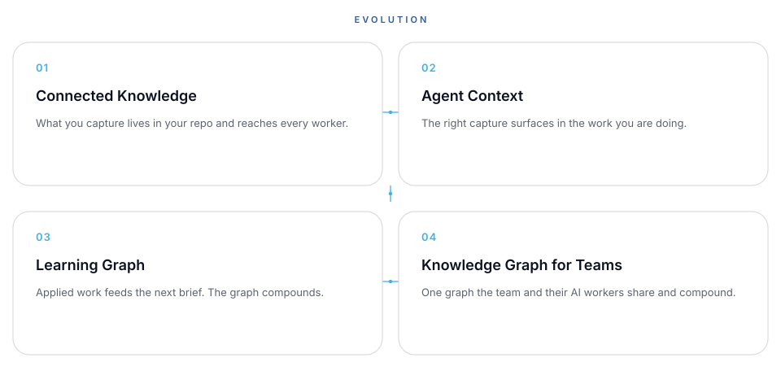

<div align="center">
  <br>
  <a href="https://mnemos-capture.vercel.app">
    <picture>
      <source media="(prefers-color-scheme: dark)" srcset="public/mnemos-hero-dark.gif">
      
    </picture>
  </a>
  <p>
    <a href="https://www.npmjs.com/package/mnemos-capture"></a>
    
    
  </p>
</div>

## Xmu

Xmu is the knowledge graph that bridges human knowledge and AI work.

Humans are constantly exposed to useful knowledge, domain expertise, and external input. But there is no bridge between what humans know and what their AI workers know and do.

Xmu builds that bridge.

## Table of Contents

- [Xmu](#xmu)
- [How it works](#how-it-works)
- [Start here](#start-here)
- [Connect your AI workers](#connect-your-ai-workers)
  - [Claude](#claude)
  - [ChatGPT](#chatgpt)
  - [Grok](#grok)
  - [Claude Code](#claude-code)
  - [Cursor](#cursor)
  - [Codex](#codex)
  - [Gemini CLI](#gemini-cli)
  - [VS Code](#vs-code)
  - [Anything MCP](#anything-mcp)
- [Workflow](#workflow)
- [What's inside](#whats-inside)
- [Your context stays in GitHub](#your-context-stays-in-github)
- [CLI](#cli)
- [Evolution](#evolution)
- [License](#license)

## How it works

You find useful stuff, you capture through the web app, then Xmu connects it into a knowledge graph, and makes it available to the AI workers you already use.

Xmu will continuously compound that knowledge over time — keeping AI workers' context up to date as human knowledge evolves.

## Start here

You do not need a terminal to start.

### 1. Create your account

Open **[mnemos-capture.vercel.app](https://mnemos-capture.vercel.app)** and sign in with GitHub.

Xmu will:

1. Create a **private** GitHub repo for your knowledge (you can opt to make it public)
2. Ask for your LLM provider API key — Anthropic, OpenAI, or Google. Your key, your cost.
3. Let you set a PIN (6+ characters) for quick unlock on this device
4. Show your **Xmu API key** once — save it if you want to connect an AI worker

That's the whole setup. No repo to clone. No database. No CLI required.

### 2. Capture something

In the app, paste a URL, a note, a doc excerpt, a transcript, or an idea, then hit **Capture**.

Xmu extracts the **core idea**, **key takeaways**, **where to apply it**, and the **capture type**, then commits Markdown to your GitHub repo.

On a phone: open the app → **Share → Add to Home Screen**. It runs like a native app.

### 3. Connect a worker (optional)

Skip this if you only want the app today. When you're ready, pick your tool under [Connect your AI workers](#connect-your-ai-workers). Capture now, connect later — the knowledge is already in your repo.

## Connect your AI workers

MCP is how AI workers talk to Xmu. Two primitives, reused everywhere:

```text
https://mnemos-capture.vercel.app/api/mcp
```

```bash
npx -y mnemos-capture@latest serve-mcp --key YOUR_API_KEY
```

Use the **URL** when the app has custom connectors (no terminal). Use the **command** when the tool can launch a local process. Finish Xmu onboarding before connecting, then ask: *list my inbox* or *brief me*.

### Claude

1. Settings → Connectors → Add custom connector
2. Name it `Xmu`
3. Paste `https://mnemos-capture.vercel.app/api/mcp`
4. Sign in with GitHub when asked

### ChatGPT

1. Turn on **Developer Mode**
2. Settings → Connectors → Add custom connector
3. Name it `Xmu`
4. Paste `https://mnemos-capture.vercel.app/api/mcp`
5. Sign in with GitHub when asked

### Grok

1. Open [grok.com/connectors](https://grok.com/connectors) → New Connector → Custom
2. Name it `Xmu`
3. Paste `https://mnemos-capture.vercel.app/api/mcp`
4. Sign in with GitHub when asked

### Claude Code

Remote (no API key):

```bash
claude mcp add --transport http mnemos https://mnemos-capture.vercel.app/api/mcp
```

Local:

```bash
claude mcp add mnemos -- npx -y mnemos-capture@latest serve-mcp --key YOUR_API_KEY
```

Optional session hooks (MCP works without them):

```bash
npx -y mnemos-capture@latest setup-hooks --key YOUR_API_KEY --briefing --vault
```

| Surface | Hooks |
| --- | --- |
| Claude Code CLI, VS Code / JetBrains extensions, desktop app | Yes |
| Claude Code on the web | No — hooks are local files |

If hooks aren't available, tell your worker: *At session start, call `list_inbox` or `briefing`.*

### Cursor

Add this to `.cursor/mcp.json` (project) or `~/.cursor/mcp.json` (all projects):

```json
{
  "mcpServers": {
    "mnemos": {
      "command": "npx",
      "args": ["-y", "mnemos-capture@latest", "serve-mcp", "--key", "YOUR_API_KEY"]
    }
  }
}
```

Or Cursor Settings → MCP → Add new MCP server, same command.

### Codex

Add this to `~/.codex/config.toml`:

```toml
[mcp_servers.mnemos]
command = "npx"
args = ["-y", "mnemos-capture@latest", "serve-mcp", "--key", "YOUR_API_KEY"]
```

Codex App: Settings → MCP → add the same command.

### Gemini CLI

```bash
gemini mcp add mnemos npx -y mnemos-capture@latest serve-mcp --key YOUR_API_KEY
```

### VS Code

Add this to `.vscode/mcp.json`:

```json
{
  "servers": {
    "mnemos": {
      "command": "npx",
      "args": ["-y", "mnemos-capture@latest", "serve-mcp", "--key", "YOUR_API_KEY"]
    }
  }
}
```

GitHub Copilot Chat in VS Code: Settings → MCP → add the same server.

### Anything MCP

If the tool has **custom connectors**, paste the URL. If it can launch a local process, register this:

```json
{
  "mcpServers": {
    "mnemos": {
      "command": "npx",
      "args": ["-y", "mnemos-capture@latest", "serve-mcp", "--key", "YOUR_API_KEY"]
    }
  }
}
```

**Claude Desktop:** Settings → Developer → Edit Config, add the block to `claude_desktop_config.json`, then fully restart.

No MCP support yet? Capture in the [Xmu app](https://mnemos-capture.vercel.app) and connect later.

## Workflow

<p align="center">
  
</p>

1. **Capture** — Paste anything text-based: papers, docs, posts, GitHub repos, notes, decisions, ideas, transcripts. Xmu detects a URL, a short note, or longer text. No manual tagging.

   From a connected worker:

   ```text
   capture "The Mom Test: don't ask if your idea is good. Ask about the person's real behavior, current workflow, and past spending."
   ```

2. **Brief** — At the start of a work session, ask your worker for a briefing. Xmu looks at your project (branch, recent commits, `CLAUDE.md`, repo context) and ranks captures that could help now: **why** it matters, **what** applying it could achieve, **where** it could land. You decide what to apply.

3. **Plan** — Select the captures you want and ask your worker to call `generate_plan`. Each plan is Markdown: codebase mapping, implementation steps with effort tiers (`simple`, `complex`, `architectural`), and a verification checklist.

4. **Execute** — Hand the plan to your worker in the current session, or run it in an isolated git worktree:

   ```bash
   npx -y mnemos-capture@latest config set agent "claude -p"
   npx -y mnemos-capture@latest kos --key YOUR_API_KEY
   ```

   `kos` creates a worktree, loads the plan as the contract, launches the assistant you configured, and prints the verification checklist when it finishes.

   ```bash
   npx -y mnemos-capture@latest config set agent "codex exec"
   ```

### Example capture

```text
The Mom Test: don't ask if your idea is good. Ask about the person's real behavior, current workflow, and past spending.
```

```markdown
---
date: 2026-06-05
source: The Mom Test note
type: note
tags: customer-discovery, product, research
status: inbox
---

# The Mom Test

## Core idea

Do not ask people to judge your idea. Ask about their real life,
recent behavior, current workaround, and what they have already
tried or paid for.

## Key takeaways

- Avoid compliments and future promises
- Ask about specific past behavior
- Look for existing pain, workarounds, and spending

## Where to apply

Discovery interview scripts, landing page tests, and product
validation prompts.
```

Plain Markdown in a repo you own. Readable, editable, versioned, portable.

## What's inside

You don't have to memorize these. Ask in plain language: "save this", "what do I have on payments?", "brief me for this repo".

| Tool | What it does |
| --- | --- |
| `capture` | Save new knowledge from pasted text or a URL |
| `list_inbox` | List captures waiting for review |
| `search_captures` | Keyword search across your captures |
| `read_capture` | Read a capture in full |
| `recall` | Find relevant context from a description of your task |
| `briefing` | Get project-specific recommendations |
| `generate_plan` | Turn selected captures into an implementation plan |
| `list_plans` | List or read saved plans |
| `apply_capture` | Mark a capture as applied |
| `archive_capture` | Archive a capture |
| `delete_capture` | Delete a capture |
| `apply_to_context` | Get file-level suggestions for the current task |
| `synthesize` | Combine related captures into reusable rules |
| `get_rules` | Retrieve those rules |
| `curate` | Review and clean up captures |
| `vault_scan` | Find relevant context for what you're about to edit |

## CLI

No global install required.

```bash
npx -y mnemos-capture@latest <command>
```

| Command | What it does |
| --- | --- |
| `npx -y mnemos-capture@latest` | Open the hosted app |
| `serve-mcp --key YOUR_API_KEY` | Run the local MCP proxy |
| `setup-hooks --key YOUR_API_KEY [--briefing] [--vault]` | Install Claude Code hooks |
| `config set agent "claude -p"` | Set which assistant `kos` should drive |
| `kos --key YOUR_API_KEY` | Implement the latest plan in an isolated worktree |
| `inbox-check --key YOUR_API_KEY [--briefing]` | Debug the session hook |
| `vault-check --key YOUR_API_KEY` | Debug the vault hook |
| `help` | Show help |

## Your context stays in GitHub

Captures live as structured Markdown in **your** GitHub repository. Private by default.

- **No lock-in** — clone it, move it, delete Xmu, keep the files
- **No proprietary format** — every capture is a readable `.md` file
- **No training on your data** — captures are sent only to the LLM provider you chose, with the key you supplied, to extract the insight you asked for
- **Any tool can read it** — anything that reads Git or speaks MCP
- **BYOK** — your provider, your key, your cost
- **Never commit your Xmu API key** to source control

### What Xmu stores, and where

The whole point of this repo being public is that you can check these claims rather than trust them.

**Your captures are never stored by Xmu.** They are written straight to your own GitHub repo as Markdown (`src/lib/github.ts`). There is no captures table. Delete the app and your knowledge is untouched.

**The database holds only account plumbing** (`src/lib/db.ts`):

| Stored | What it is |
| --- | --- |
| `github_id`, `github_username` | who you are |
| `github_token` | encrypted (`src/lib/crypto.ts`) |
| `github_repo` | the *name* of your hub, not its contents |
| `pin_hash` | salted scrypt (`src/lib/pin.ts`) |
| `api_key` | hashed — not recoverable |
| `llm_provider`, `llm_api_key` | encrypted |
| `token_version` | bumped to revoke everything |
| login attempts, OAuth clients/codes, refresh-token ids | auth plumbing |

When you capture, the server talks to exactly three kinds of destination:

1. **GitHub** — to write the capture into your repo
2. **Your LLM provider**, with *your* key — Anthropic, OpenAI, or Google
3. **The page you captured** — if you paste a bare URL, so the model reads real content. Only http/https, never an internal address

No analytics, no telemetry, no third-party tracking.

### How your credentials are stored

| Secret | How it's stored |
| --- | --- |
| GitHub token | Encrypted at rest (AES-256-GCM). Uses the `repo` scope, required to read and write a **private** knowledge hub |
| Your LLM API key | Encrypted at rest (AES-256-GCM) |
| Your MCP API key | Hashed — never recoverable, not even by Xmu |
| Your PIN | Salted scrypt hash |

Your MCP key is shown exactly once. If you lose it, generate a new one.

**PIN unlock is device-bound.** It only works on a device that has already signed in with GitHub. A PIN on its own is not enough to reach your account.

**Revoking access.** Generating a new MCP key invalidates the old key, every signed-in session, and every connected MCP client. Sessions also expire after 30 days.

## Cost

Xmu is BYOK. You bring your own API key. Xmu never charges you for inference.

Extraction runs on a fast, low-cost model (Claude Haiku 4.5 by default):

| Usage | Estimated monthly cost |
| --- | --- |
| 50 captures/month | ~$0.15 |
| 100 captures/month | ~$0.30 |
| 200 captures/month | ~$0.60 |

Briefing, planning, and synthesis only run when you ask for them.

## Evolution

<p align="center">
  <picture>
    <source media="(prefers-color-scheme: dark)" srcset="public/flow-evolution-dark.svg">
    
  </picture>
</p>

Working on the code? See [CONTRIBUTING.md](CONTRIBUTING.md).

## License

[MIT License](./LICENSE)

If you use Xmu in published work:

```bibtex
@misc{2026mnemos,
  title        = {Xmu: A Knowledge Graph for AI workers},
  author       = {Sofia Padron Valdez},
  year         = 2026,
  journal      = {GitHub repository},
  publisher    = {GitHub},
  howpublished = {\url{https://github.com/Soph20/mnemos-capture}}
}
```
