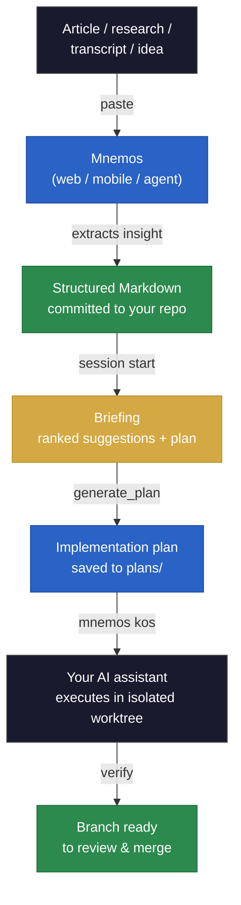

<p align="center">
  
</p>

<h1 align="center">Mnemos</h1>

<p align="center">
  
  
  
</p>

<p align="center"><strong>Capture anything. Your agents apply it.</strong></p>

<p align="center">
  Humans consume information. Agents execute information.<br/>
  <em>Mnemos converts one into the other.</em>
</p>

<p align="center">A knowledge pipeline that turns what you learn into actionable context for AI agents.</p>

---

Your agent only knows what it was trained on. It doesn't know the article you read this morning, the framework you found last week, or the decision you made last sprint.

**Mnemos bridges that gap.**

Capture an insight once. Mnemos extracts it, stores it as plain Markdown in your own GitHub repository, indexes it, and serves it to any MCP-compatible agent.

Then it goes further. At session start, Mnemos briefs your agent on what matters right now, surfaces relevant knowledge in context, synthesizes reusable rules, and turns insights into implementation plans.

> **The result isn't another knowledge base.** It's a system that transforms what you learn into what your agents can execute.

<p align="center"><sub>Works with <strong>Claude Code</strong> · <strong>Codex</strong> · <strong>Cursor</strong> · <strong>Gemini</strong> · and any MCP-compatible assistant.</sub></p>


## Get started

### 1. Sign up (30 seconds)

Go to **[mnemos-capture.vercel.app](https://mnemos-capture.vercel.app)** → **Sign in with GitHub**.

During setup, Mnemos will:

- Create a knowledge repo in your GitHub account — plain Markdown files, no proprietary format
- Ask for your API key (your provider, your key — Mnemos never pays for your API calls)
- Set a PIN (minimum 6 characters) to re-unlock the app quickly on **this device** — see below

No config files. No repos to clone. No CLI setup required.

### 2. Connect to your AI assistant

Mnemos exposes the **same 15 tools** two ways. Both hit the hosted API over HTTPS; nothing is stored locally — your knowledge lives in your GitHub repo. Pick whichever your tool supports:

- **A — Remote connector (OAuth).** Add one URL; the client signs you in. No key to paste. Best for the Claude apps and any client that speaks the MCP *remote / Streamable HTTP* transport.
- **B — Local stdio proxy (static key).** A tiny `npx` process bridges a stdio client to the hosted API using a personal key. The universal fallback — works with any MCP client that can launch a local command.

#### A — Remote connector (OAuth 2.1)

In the Claude app (iOS / Android / desktop / web): **Settings → Connectors → Add custom connector**, then enter your instance's MCP URL:
```
https://mnemos-capture.vercel.app/api/mcp
```
The client fetches the discovery metadata, opens a **Mnemos sign-in (GitHub)**, and you approve on the consent screen — no key to paste. Behind the scenes it's a standards-compliant OAuth 2.1 authorization-code + PKCE flow over the MCP Streamable HTTP transport, so any client that implements that flow can connect the same way. Requires your account to be onboarded (knowledge repo + LLM key set) first.

#### B — Local stdio proxy (static key)

When you finish onboarding, Mnemos generates a personal **MCP API key** — copy it, then:

**Claude Code:**
```bash
claude mcp add mnemos -- npx -y mnemos-capture@latest serve-mcp --key <your-mcp-key>
```

**Claude Desktop (macOS / Windows):** **Settings → Developer → Edit Config**, add Mnemos to `claude_desktop_config.json`, then fully restart Claude Desktop:
```json
{
  "mcpServers": {
    "mnemos": {
      "command": "npx",
      "args": ["-y", "mnemos-capture@latest", "serve-mcp", "--key", "<your-mcp-key>"]
    }
  }
}
```

**Any other MCP client that launches local commands** (Cursor, Continue, Windsurf, Cline, Codex CLI, Gemini CLI, Zed, …) — register the same command in that client's MCP config:
```bash
npx -y mnemos-capture@latest serve-mcp --key <your-mcp-key>
```

#### Which method does my tool support?

| Client | Remote connector (A) | stdio proxy (B) |
|---|---|---|
| Claude iOS / Android / web | ✅ | — (no local process) |
| Claude Desktop | ✅ | ✅ |
| Claude Code (CLI / IDE) | ✅ `claude mcp add --transport http` | ✅ |
| VS Code (Copilot MCP) | ✅ | ✅ |
| Cursor, Continue, Windsurf, Cline, Zed | varies by version | ✅ |
| Codex CLI, Gemini CLI | varies by version | ✅ |
| ChatGPT / OpenAI Responses API (`mcp` tool) | ✅ remote MCP w/ OAuth | — |
| A browser tab, or an assistant with **no** MCP client (e.g. plain Gemini/Grok apps) | — | — (see Roadmap) |

Rule of thumb: **if the client can speak remote MCP, use A**; otherwise fall back to **B**. Tools with no MCP support at all can't use either — those are what the Chrome extension and per-tool integrations on the roadmap are for.

### 3. Capture something

Open the app on any device — phone, tablet, or desktop. Paste any content and hit **Capture**. Or capture directly from your agent:

```
capture "The Mom Test — don't ask if your idea is good, ask about their life."
```

That's it. Your knowledge is now indexed and available to every agent session.


## How it works


```mermaid
flowchart TD
    A["Article / research /\ntranscript / idea"] -->|paste| B["Mnemos\n(web / mobile / agent)"]
    B -->|extracts insight| C["Structured Markdown\ncommitted to your repo"]
    C -->|session start| D["Briefing\nranked suggestions + plan"]
    D -->|generate_plan| E["Implementation plan\nsaved to plans/"]
    E -->|mnemos kos| F["Your AI assistant\nexecutes in isolated worktree"]
    F -->|verify| G["Branch ready\nto review & merge"]

    style A fill:#1a1a2e,stroke:#444,color:#fff
    style B fill:#2A62C6,stroke:#1a4a9e,color:#fff
    style C fill:#2d8a4e,stroke:#1e6b3a,color:#fff
    style D fill:#d4a843,stroke:#b8912e,color:#fff
    style E fill:#2A62C6,stroke:#1a4a9e,color:#fff
    style F fill:#1a1a2e,stroke:#444,color:#fff
    style G fill:#2d8a4e,stroke:#1e6b3a,color:#fff
```

1. **Capture** — paste anything text-based. Mnemos extracts the core idea, key takeaways, where to apply it, and auto-detects whether it's a URL, short note, or long paste. Committed to your GitHub repo as structured Markdown.
2. **Brief** — at session start, the `--briefing` flag sends your project context (branch, recent commits, CLAUDE.md) to Mnemos. It returns ranked suggestions — *why* each insight matters now, *what* applying it achieves, *where* in your codebase.
3. **Plan** — `generate_plan` reads your selected captures and produces a structured Markdown plan: Codebase Mapping table, per-file steps with effort tiers (`simple` / `complex` / `architectural`), and a Verification Checklist.
4. **Execute** — `mnemos kos` creates an isolated git worktree, launches your configured AI assistant with the plan as its contract, and runs the verification checklist when it's done.


## What you can feed it

If it's text, Mnemos can extract insight from it. No manual tagging required.

- **Research papers and preprints** — new models, architectures, evaluation methods
- **Framework and library docs** — patterns, APIs, integration approaches worth keeping
- **Technical threads and writeups** — the argument or finding, not the noise
- **Optimization techniques** — prompt engineering, caching strategies, latency improvements
- **Your own ideas** — architecture decisions, workflow changes, things you want your agents to act on later
- **Transcripts and talks** — signal extracted, ready to apply


## Example capture

Paste a research post about error observability. This is what lands in your repo:

```markdown
---
date: 2026-06-05
source: Error Context First — Observability for AI Systems
url: https://example.com/error-context
type: post
source_type: url
tags: observability, error-handling, ai-agents, debugging
status: inbox
lowConfidence: false
---

# Error Context First — Observability for AI Systems

## Core idea
Opaque error messages make every fix a guess. Adding source context to every
error — which handler, which step, which input — turns debugging from archaeology
into a directed search.

## Key takeaways
- Every catch block should prefix messages with where it came from
- "The string did not match the expected pattern" is useless; "[github-write] ..." is actionable
- Instrument before you fix — opaque errors cause repeated misdiagnoses

## Applied to
Add handler-name prefixes to every catch block in your agent's tool pipeline.
```

`source_type` is auto-detected (`url` / `note` / `paste`). `lowConfidence` flags short or ambiguous input for review before acting on it.


## Knowledge lifecycle

```
  ┌─────────┐
  │  Capture │
  └────┬─────┘
       ▼
  ┌─────────┐     ┌──────────┐
  │  Inbox   │────▶│  Applied  │   Insight used — plan executed, rule added, code changed
  └────┬─────┘     └──────────┘
       │
       ├──────────▶┌──────────┐
       │           │ Archived  │   Reviewed, not actionable right now
       │           └──────────┘
       │
       └──────────▶┌──────────┐
                   │ Deleted   │   Not useful, permanently removed
                   └──────────┘
```

All captures are tracked in `INDEX.md` — a master table your agents search across your entire knowledge base. Generated plans land in `plans/`.


## Session hooks

`serve-mcp` writes a `SessionStart` hook to `~/.claude/settings.json` on first run. Every session opens with your inbox count:

```
Mnemos: 4 captures in inbox — run list_inbox to review
```

### Briefing mode

Opt in for a structured briefing instead of a count:

```bash
npx -y mnemos-capture@latest setup-hooks --key YOUR_KEY --briefing
```

At session start, Mnemos collects your project context — branch, recent commits, CLAUDE.md excerpt — and returns:

1. Ranked suggestions with `why`, `benefit`, `where`, and whether to apply now
2. Relevant synthesized rules
3. A `generate_plan` prompt pre-loaded with the captures to apply

```
3 insights to apply now:

1. error-context-first → src/app/api/capture/route.ts
   Why: Your current branch rewrites the capture pipeline and all catch blocks are opaque
   Benefit: Every error will identify its source in < 1 line

Run generate_plan with selected_captures: ["inbox/2026-06-05-error-context-first.md"]
```

### Vault mode (PreToolCall hook)

Surfaces relevant captures *before* you edit a file — not just at session start:

```bash
npx -y mnemos-capture@latest setup-hooks --key YOUR_KEY --vault
```

Before every `Edit`, `Write`, or `MultiEdit` tool call, Mnemos scans your vault for captures scoring ≥ 0.7 relevance to the file you're about to touch. Each capture is surfaced at most once per session.

Opt-in only — not installed by default because it fires on every file edit.

### Compatibility

| Surface | Hook fires |
|---|---|
| Claude Code CLI, VS Code / JetBrains extensions, desktop app | Yes |
| Claude Code on the web | No — `~/.claude/settings.json` is local only |
| Cursor / other MCP clients | No — distinct hook systems |

MCP tools work everywhere. For unsupported surfaces, add to `CLAUDE.md`:

> At session start, call `list_inbox` to surface pending captures.


## MCP tools

Mnemos exposes 15 tools via MCP:

### Capture

| Tool | What it does |
|------|-------------|
| `capture` | Extracts insight from any pasted content. Auto-detects source type, flags low-confidence input, auto-links to related captures. |

### Discover

| Tool | What it does |
|------|-------------|
| `list_inbox` | Unprocessed captures with summaries — title, type, tags, core idea. Page the whole inbox with `offset`/`limit` (default 10, max 50) and narrow by date with `since`/`until`; the footer reports the total and next `offset`. |
| `search_captures` | Keyword + tag search across inbox, applied, and archived. Query is tokenized and OR-matched (any term hits), ranked by term-match count with an exact-phrase bonus — one unknown word no longer zeroes the query. Omit `query` to list ALL captures. Page all matches with `offset`/`limit` (default 20, max 50) and filter by date with `since`/`until`. |
| `read_capture` | Full Markdown of any capture. |
| `recall` | Semantic search — describe your task, get the most relevant captures back. More powerful than keyword search. |

### Apply

| Tool | What it does |
|------|-------------|
| `apply_capture` | Moves inbox → applied. Records how and where knowledge was used, which plan drove it, and what changed. Triggers rule re-synthesis. |
| `archive_capture` | Moves inbox → archived. Reviewed but not actionable now. |
| `delete_capture` | Permanently removes a capture and its index entry. |
| `apply_to_context` | Paste task + stack + code snippet → get concrete, file-level suggestions for applying your captured knowledge. |

### Plan

| Tool | What it does |
|------|-------------|
| `briefing` | Session-start briefing: ranked suggestions with `applyNow` flags, relevant rules, and a `generate_plan` prompt. Requires `project_context`. |
| `generate_plan` | Reads selected captures + optional codebase files → structured Markdown plan with Codebase Mapping table, effort tiers per step, and Verification Checklist. Saved to `plans/`. |
| `list_plans` | Lists saved plans, or reads a specific plan in full. |

### Synthesize

| Tool | What it does |
|------|-------------|
| `synthesize` | Distills captures on a tag into actionable rules. Updates `RULES.md`. |
| `get_rules` | Returns synthesized rules — filtered by tag or all. Use to populate `CLAUDE.md` or a system prompt. |

### Curate

| Tool | What it does |
|------|-------------|
| `curate` | Validates inbox captures: HEAD-checks URLs (404/410 → stale), flags low-confidence extractions. Optional `auto_archive`. Page through the inbox with `offset`/`limit` (default 20, max 50) and scope by date with `since`/`until`; the footer reports the total and next `offset`. |
| `vault_scan` | Scans the full vault for captures relevant to your current activity (score ≥ 0.7). Used by the vault hook. |


## CLI

```
mnemos-capture                                              Open hosted app
mnemos-capture serve-mcp --key KEY                         Run local MCP proxy (auto-installs hook)
mnemos-capture setup-hooks --key KEY [--briefing] [--vault] Install session hooks
mnemos-capture inbox-check --key KEY [--briefing]          Debug what the hook runs
mnemos-capture vault-check --key KEY                       Debug what the vault hook runs
mnemos-capture help                                        Show help
```

All commands run via `npx -y mnemos-capture@latest <subcommand>`. `@latest` forces npm to resolve against the registry on every invocation.


## Mobile

Open Mnemos in your phone's browser → **Share → Add to Home Screen**. Runs full-screen like a native app. Capture while reading — your agents have it by the time you sit down to work.


## Your data, your storage

Your knowledge lives in a GitHub repo you own. Plain Markdown files, version-controlled, portable.

- **No lock-in** — clone it, move it, delete Mnemos and your repo stays exactly where it is
- **No proprietary format** — every capture is a readable `.md` file
- **No training on your data** — Mnemos never reads your captures for any purpose other than serving them back to you
- **Any tool can access it** — anything that reads Git or speaks MCP works with your knowledge base
- **BYOK** — your provider, your key, your cost

### How your credentials are stored

Mnemos holds three secrets on your behalf. None of them is stored in a form that is useful to anyone who reads the database:

| Secret | How it's stored |
|---|---|
| GitHub token | Encrypted at rest (AES-256-GCM) |
| Your LLM API key | Encrypted at rest (AES-256-GCM) |
| Your MCP API key | Hashed — never recoverable, not even by Mnemos |
| Your PIN | Salted scrypt hash |

Your MCP key is shown to you exactly once, when it's generated. If you lose it, generate a new one — Mnemos cannot show you the old one again.

**PIN unlock is device-bound.** The PIN is a quick re-unlock, not a password: it only works on a device that has already signed in with GitHub, and it unlocks *that* device. On any new device — or after you revoke access — you sign in with GitHub first, then the PIN becomes available there. A PIN on its own is not enough to reach your account from anywhere.

**Revoking access.** Generating a new MCP key is also the kill switch: it immediately invalidates the old key, every signed-in session, and every connected MCP client. Anything still holding an old credential stops working at once and has to reconnect. Sessions also expire on their own after 30 days.


## Cost

Mnemos is BYOK — you bring your own API key, Mnemos never charges you for inference.

Extraction runs on a fast, low-cost model (Claude Haiku 4.5 by default) with prompt caching and input truncation:

| Usage | Estimated monthly cost |
|-------|----------------------|
| 50 captures/month | ~$0.15 |
| 100 captures/month | ~$0.30 |
| 200 captures/month | ~$0.60 |

Briefing and plan generation use your configured model and only run when you explicitly invoke them.


## Tech stack

Next.js · TypeScript · Vercel Postgres · GitHub OAuth · GitHub Content API · MCP protocol · Anthropic SDK · Tailwind CSS · Vitest


## Roadmap

Shipped:

- the `mnemos kos` orchestrator (isolated worktree, plan-as-contract, verification checklist)
- provider-agnostic BYOK (Anthropic, OpenAI, Google)
- **Web + app access** — Mnemos is an **OAuth 2.1 remote MCP connector** over the Streamable HTTP transport, so your knowledge base works in the Claude web and desktop/mobile apps (and any MCP client that speaks the remote flow), not just the CLI

Next — reaching tools where the MCP connector *doesn't* work (no MCP client, or MCP behind a wall):

- **Chrome extension** — one-click capture from any browser tab, for surfaces with no MCP client at all
- **Per-tool integrations** — thin adapters for assistants that can't (yet) speak remote MCP, so the same capture library shows up there too
- **One key → any provider** — a single gateway key that routes to any model, instead of per-provider BYOK
- **Voice memo capture** — record a memo; Mnemos transcribes it and captures the insight
- **`kos` enhancements** — per-step model switching within a run, and `--detach` for background execution


## Built by

[Sofía Padrón Valdez](https://github.com/Soph20) — builder, AI systems architect.


## Citation

```
@misc{2026mnemos,
    title        = {Mnemos: A Knowledge Pipeline for AI Agents},
    author       = {Sofia Padron Valdez},
    year         = 2026,
    journal      = {GitHub repository},
    publisher    = {GitHub},
    howpublished = {\url{https://github.com/Soph20/mnemos-capture}}
    }
```

## License

[MIT License - see LICENSE file for details](./LICENSE)
